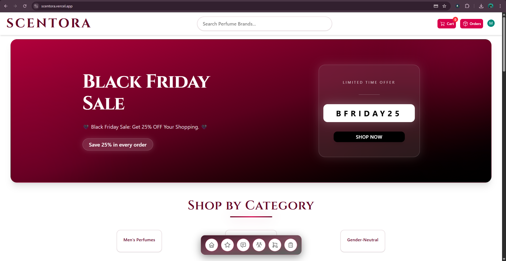
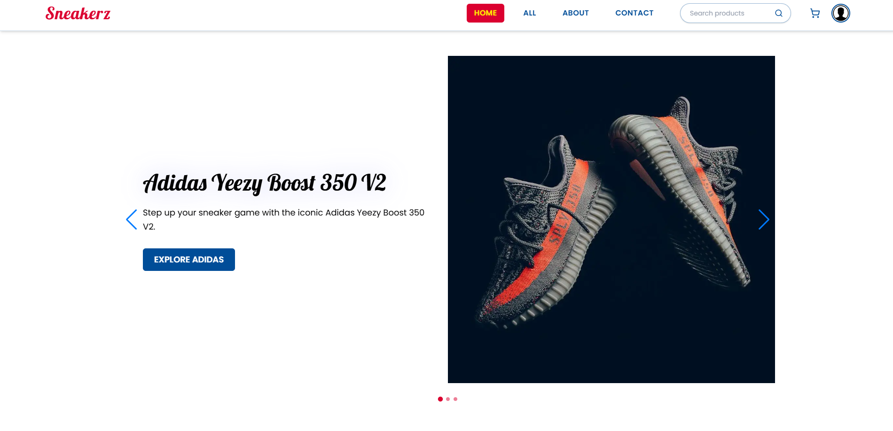

<!-- ================= Header / Banner ================= -->

  

# 🌟 Hi, I’m **Mahedy Hasan**
### Full-Stack Web Developer | React · Next.js · Node.js · MongoDB · Sanity · TypeScript · Tailwind

  
  
  

---

## 👋 About Me

I’m a passionate **Full-Stack Web Developer** building modern, scalable, and user-centric digital products.  
I specialize in **Next.js**, **React**, **Node.js**, and **MongoDB**, with a strong focus on **UI/UX**, **performance**, and **clean architecture**.

✨ I enjoy:  
- 🎨 Crafting beautiful, responsive UIs  
- ⚙️ Building backend APIs & dashboards  
- 🏗 Architecting scalable applications  
- 📚 Learning new technologies & best practices  

---

## 🛠 Tech Stack

### Frontend

  

### Backend / Databases / CMS

  

### Tools & Others

  

---

## 🚀 Featured Projects

### 🔥 Project 1 — Front-End Ecommerce Website
A clean, modern **front-end ecommerce UI** built with Next.js & Tailwind.  
**Code:** [GitHub](https://github.com/mahedy25/Mahedy2002)  
**Live Demo:** [Visit Site](https://mahedyhasan.vercel.app/)

  

---

### 🛒 Project 2 — Full Stack Ecommerce Platform
A complete **ecommerce system** with product management, CMS, and modern UI.  
**Tech:** Next.js · Sanity CMS · Tailwind · Modern UI  
**Code:** [GitHub](https://github.com/mahedy25/Scentora)  
**Live Demo:** [Visit Site](https://scentora.vercel.app/)

  

---

### 👟 Project 3 — Sneakerz Ecommerce UI
A stylish **ecommerce frontend** designed for product browsing & interactions.  
**Code:** [GitHub](https://github.com/mahedy25/Sneakerz-Front-end)  
**Live Demo:** [Visit Site](https://sneakerz-front-end.vercel.app/)

  

---

## 📊 GitHub Stats

  

  

  

---

## 📫 Connect With Me

---

## 🧠 Quote I Live By
> 💡 “Code is like humor. When you have to explain it, it’s bad.” – Cory House  

---

## ⚡ Always Building. Always Learning. Always Improving.

  

