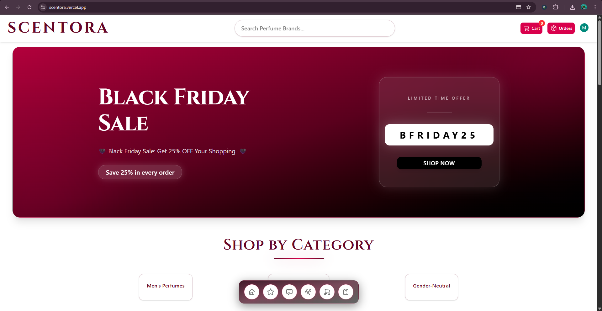
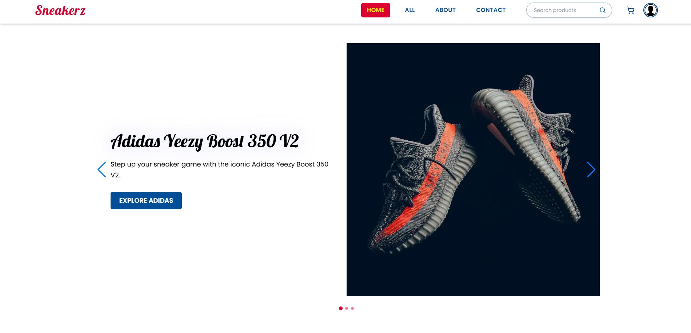

# 🌟 Hi, I’m **Mahedy Hasan**

### Frontend Developer | React · Next.js · TypeScript · Tailwind | Future Full-Stack Developer

---

## 👋 About Me

I’m a **Frontend Developer** focused on building **fast, modern, and scalable web experiences**.

I specialize in creating **clean UI, smooth interactions, and performance-driven websites** using modern technologies.

✨ What I do:

* 🎨 Build **responsive and visually strong UIs**
* ⚡ Develop **fast & optimized web applications**
* 🎬 Add **smooth animations & interactions**
* 🧩 Create **scalable frontend architectures**

🚀 Currently exploring backend development with **Node.js, Express.js & MongoDB**
📈 Goal: Becoming a **Full-Stack Developer**

---

## 🛠 Tech Stack

### Frontend

  

### UI & Animations

  
  

### Backend (Learning)

  

### CMS & Tools

  
  

---

## 🚀 Featured Projects

### 🔥 Portfolio Website

**Tech:** Next.js · Tailwind · Framer Motion
**Code:** [GitHub](https://github.com/mahedy25/Mahedy2002) · **Live:** [Demo](https://mahedyhasan.vercel.app/)

---

### 🛒 Full Stack Ecommerce Platform

**Tech:** Next.js · Sanity CMS · Tailwind
**Code:** [GitHub](https://github.com/mahedy25/Scentora) · **Live:** [Demo](https://scentora.vercel.app/)

---

### 👟 Sneakerz Ecommerce Frontend

**Tech:** Next.js · Tailwind · Framer Motion
**Code:** [GitHub](https://github.com/mahedy25/Sneakerz-Front-end) · **Live:** [Demo](https://sneakerz-front-end.vercel.app/)

---

## 📊 GitHub Insights

  
   
  

---

## 📫 Connect With Me

  
  
  

---

## ⚡ Always Building. Always Learning. Always Improving

  

  

